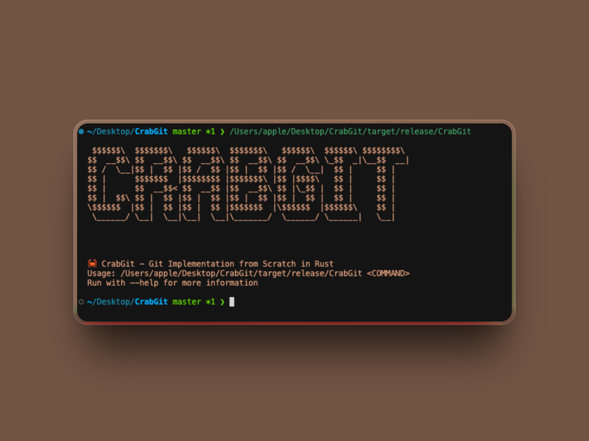
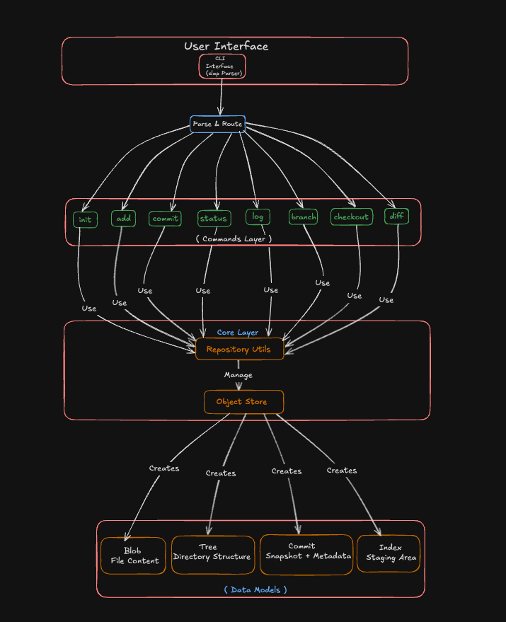
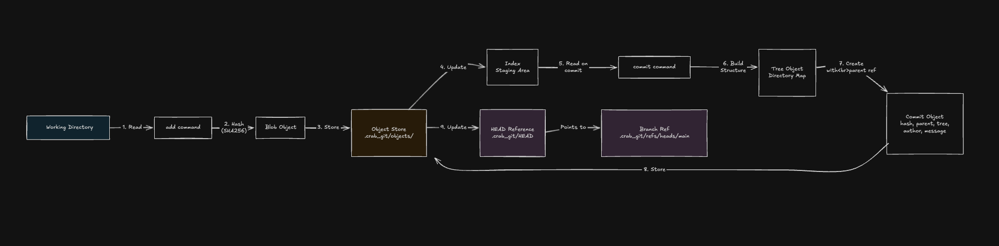
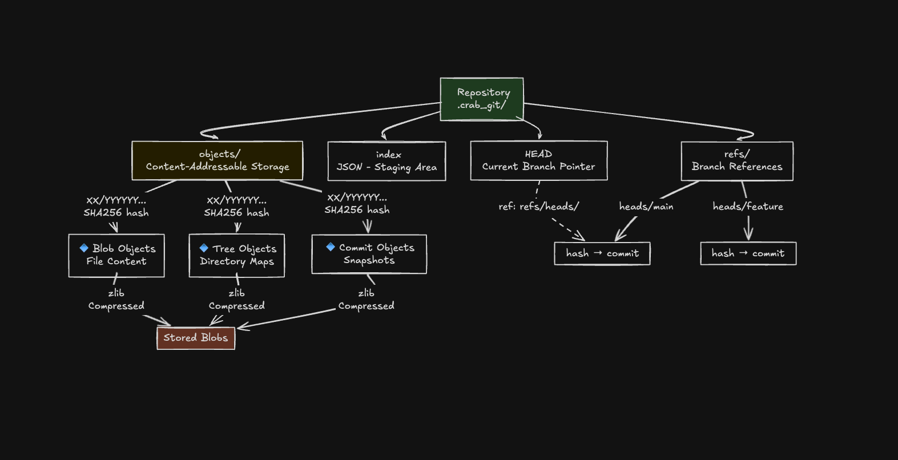
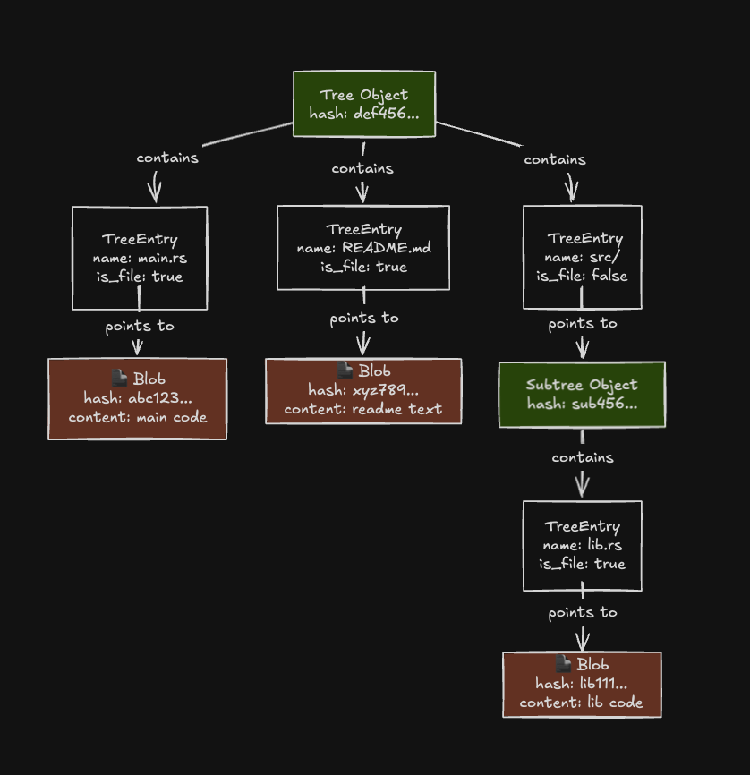
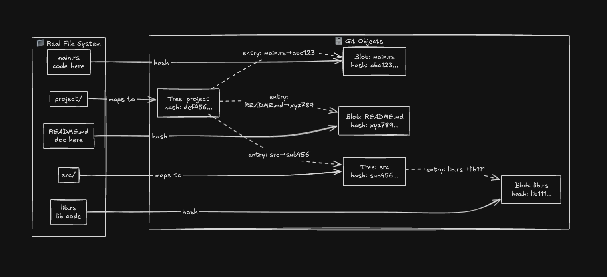
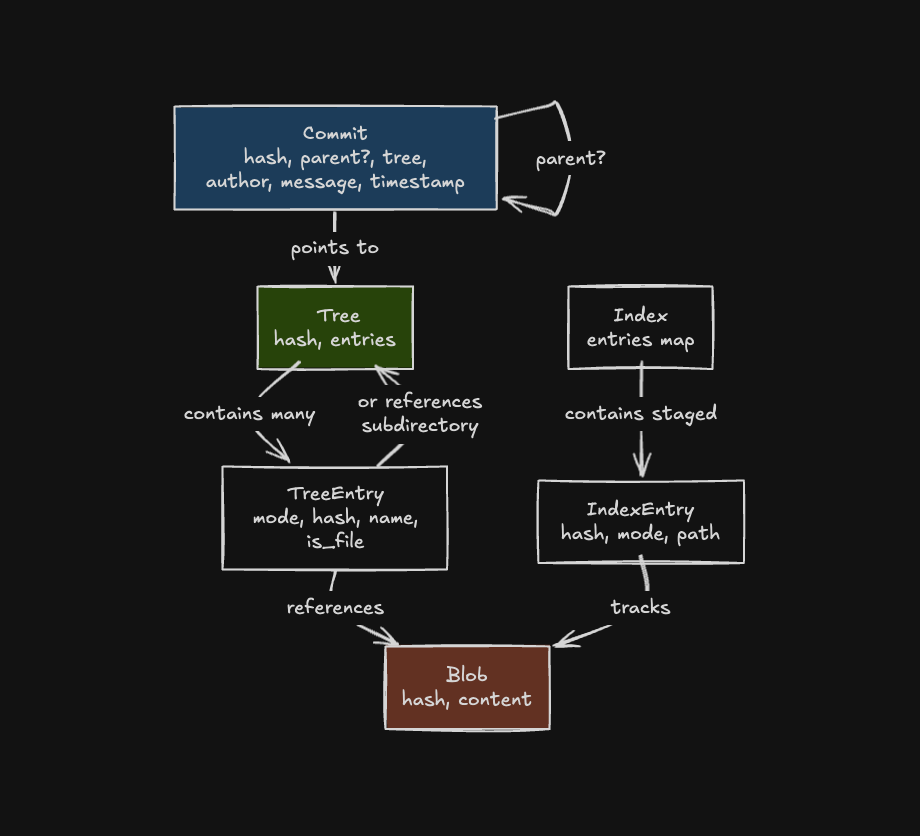

# 🦀 CrabGit - Git Implementation from Scratch in Rust



Building Git from the ground up in Rust. CrabGit is a local-only implementation that helps you understand how Git actually works under the hood, no network complexity, just the core fundamentals.

## Current Features

### Repository Management
- `init` - Initialize a new repository
- `status` - View working directory status
- `add` - Stage files for commit

### Version Control
- `commit` - Create snapshots with message and author
- `log` - View commit history
- `diff` - Show file differences

### Branching
- `branch` - List, create, or delete branches
- `checkout` - Switch to a branch or commit

---

## System Architecture

### Layered Architecture Overview

CrabGit follows a **four-layer architecture**:

```
┌─────────────────────────────────────────┐
│  User Interface Layer                │
│  (CLI Interface with clap Parser)       │
└────────────────┬────────────────────────┘
                 │
┌────────────────▼────────────────────────┐
│  Commands Layer                      │
│  (init, add, commit, status, log,       │
│   branch, checkout, diff)               │
└────────────────┬────────────────────────┘
                 │
┌────────────────▼────────────────────────┐
│  Core Layer                          │
│  (Repository Utils + Object Store)      │
└────────────────┬────────────────────────┘
                 │
┌────────────────▼────────────────────────┐
│  Data Models                         │
│  (Blob, Tree, Commit, Index, Branch)    │
└─────────────────────────────────────────┘
```

**Key Points:**
- **UI Layer** parses user input and routes to appropriate commands
- **Commands Layer** implements Git operations, each command follows the same pattern
- **Core Layer** manages repositories, calculates hashes, and interacts with storage
- **Data Models** define the types that represent Git concepts



---

## Complete Data Flow: Add → Commit Workflow

Understanding how data flows through the system is crucial to grasping Git's design:

### Step-by-Step Flow

**Phase 1: Adding Files**
1. User runs `crab_git add file.txt`
2. Working directory is scanned, file content is read
3. SHA256 hash is calculated from file content
4. A **Blob object** (compressed file content) is created and stored in `.crab_git/objects/`
5. **Index file** (staging area) is updated with entry: `file.txt → blob_hash`

**Phase 2: Creating Commit**
1. User runs `crab_git commit -m "message"`
2. Index is read, all staged files are gathered
3. A **Tree object** is built representing the directory structure
4. A **Commit object** is created with:
   - Reference to tree object (directory snapshot)
   - Reference to parent commit (history link)
   - Author and message metadata
   - Timestamp
5. Commit object is stored in object store
6. Current branch reference is updated to point to new commit hash
7. **HEAD** file is updated to reflect current branch

### Data Storage Path

```
Working Directory
    ↓ (add)
Object Store (Blobs)
    ↓ (commit)
Index (Staging)
    ↓ (commit)
Tree Objects (Directory Maps)
    ↓
Commit Objects (Snapshots)
    ↓
Branch References (HEAD)
```



---

## Object Store Structure

The `.crab_git` directory is where Git stores everything about your repository:

```
.crab_git/
├── objects/                          # Content-Addressable Storage
│   ├── ab/                          # First 2 chars of SHA256 hash
│   │   ├── cdef1234567...           # Remaining 62 chars (Blob: file content)
│   │   └── 9876543210a...           # (Tree: directory structure)
│   ├── de/
│   │   └── f123456789b...           # (Commit: snapshot + metadata)
│   └── 12/
│       └── 3456789abcdef...         # Objects are zlib compressed
│
├── index                            # Staging Area
│                                    # JSON format: {file_path → hash}
│
├── HEAD                             # Current Branch Pointer
│                                    # Contains: "ref: refs/heads/main"
│
├── refs/                            # Reference Storage
│   └── heads/
│       ├── main                     # Contains: commit hash
│       └── feature                  # Points to commit SHA256
│
└── config                           # Repository Configuration
```

### Object Storage Details

**Content Addressing:**
- Objects are identified by SHA256 hash of their content
- Hash format: First 2 chars become directory, remaining 62 chars become filename
- Example: `hash ab12cd...ef → .crab_git/objects/ab/12cd...ef`

**Compression:**
- All objects are compressed using zlib
- Reduces storage space significantly
- Decompressed on read

**Object Types:**
- **Blobs**: Raw file content (immutable)
- **Trees**: Directory snapshots (maps filenames to blob/tree hashes)
- **Commits**: Snapshots with history (points to tree, parent commit, metadata)



---

## Data Models & Type Relationships

### Core Types

**Blob Object**
```
Represents file content
{
  hash: "abc123...",
  content: [file bytes]
}
```

**Tree Object**
```
Represents directory structure
{
  hash: "def456...",
  entries: {
    "file.txt": TreeEntry { mode, hash, name, is_file: true },
    "src/": TreeEntry { mode, hash, name, is_file: false }
  }
}
```

**TreeEntry**
```
References file or subdirectory
{
  mode: "644",           # Unix permissions
  hash: "blob_or_tree_hash",
  name: "filename",
  is_file: true/false
}
```

**Commit Object**
```
Represents a snapshot in history
{
  hash: "ghi789...",
  parent: Some("parent_commit_hash"),  # None for initial commit
  tree: "def456...",                   # Points to tree object
  author: "John Doe <john@example.com>",
  message: "Commit message",
  timestamp: "2024-11-15T10:30:00Z"
}
```

**Index** (Staging Area)
```
Tracks what will be committed
{
  entries: {
    "file.txt": IndexEntry { hash, mode, path },
    "src/main.rs": IndexEntry { hash, mode, path }
  }
}
```





### Relationships

```
Commit Chain:
  Commit A (initial)
    └─ tree: Tree A
         └─ entry: file.txt → Blob A

  Commit B (second)
    ├─ parent: Commit A
    └─ tree: Tree B
         ├─ entry: file.txt → Blob B (modified)
         └─ entry: README.md → Blob C (new file)

  Commit C (third)
    ├─ parent: Commit B
    └─ tree: Tree C
         └─ ...
```

**Key Insight:** Every commit is a complete snapshot. Changed files get new blobs, unchanged files reuse the same blob hashes.



---

## Quick Start

### Installation

```bash
git clone https://github.com/abhinavkale-dev/CrabGit.git
cd CrabGit
cargo build --release
```

### Basic Usage

#### On macOS and Linux:
```bash
# Initialize a repository
./target/release/CrabGit init

# Create and track files
echo "Hello, CrabGit!" > hello.txt
./target/release/CrabGit add hello.txt

# Create a commit
./target/release/CrabGit commit "Initial commit" --author "You <you@example.com>"

# View history
./target/release/CrabGit log

# Check status
./target/release/CrabGit status

# Create and manage branches
./target/release/CrabGit branch feature
./target/release/CrabGit branch

# Switch to a branch
./target/release/CrabGit checkout feature
```

#### On Windows (PowerShell):
```powershell
# Initialize a repository
.\target\release\CrabGit.exe init

# Create and track files
echo "Hello, CrabGit!" > hello.txt
.\target\release\CrabGit.exe add hello.txt

# Create a commit
.\target\release\CrabGit.exe commit "Initial commit" --author "You <you@example.com>"

# View history
.\target\release\CrabGit.exe log

# Check status
.\target\release\CrabGit.exe status

# Create and manage branches
.\target\release\CrabGit.exe branch feature
.\target\release\CrabGit.exe branch

# Switch to a branch
.\target\release\CrabGit.exe checkout feature
```

---

## 📋 Commands Reference

> **Note:** Replace `./target/release/CrabGit` (macOS/Linux) with `.\target\release\CrabGit.exe` (Windows PowerShell) in all commands below.

### Repository Management

```bash
./target/release/CrabGit init [path]                    # Initialize repository
./target/release/CrabGit status                         # Show working directory status
```

### Staging & Committing

```bash
./target/release/CrabGit add <files>                    # Stage files
./target/release/CrabGit add .                          # Stage all files
./target/release/CrabGit commit <message>               # Create commit
./target/release/CrabGit commit <message> --author "Name <email>"  # With author
```

### History & Inspection

```bash
./target/release/CrabGit log [--max-count N]            # Show commit history
./target/release/CrabGit diff [files]                   # Show file differences
```

### Branching

```bash
./target/release/CrabGit branch                         # List branches
./target/release/CrabGit branch <name>                  # Create branch
./target/release/CrabGit branch <name> --delete         # Delete branch
./target/release/CrabGit checkout <branch>              # Switch branch
```

---

## Project Structure

```
CrabGit/
├── src/
│   ├── main.rs                         # CLI entry point
│   ├── lib.rs                          # Core types & module exports
│   ├── object_store.rs                 # Storage & hashing logic
│   ├── utils.rs                        # Repository utilities
│   └── commands/
│       ├── mod.rs                      # Command module exports
│       ├── init.rs                     # Repository initialization
│       ├── add.rs                      # File staging
│       ├── commit.rs                   # Commit creation
│       ├── status.rs                   # Working directory status
│       ├── log.rs                      # History viewing
│       ├── branch.rs                   # Branch management
│       ├── checkout.rs                 # Branch switching
│       └── diff.rs                     # File differences
├── Cargo.toml                          # Dependencies
└── README.md                           # This file
```

---

## Architecture Details

### How Commands Execute

1. **Parsing Phase**: User input is parsed using `clap` framework
2. **Routing Phase**: Matched command variant is identified
3. **Repository Loading**: Current repository is located and loaded
4. **Execution Phase**: Command logic executes with repository context
5. **Storage Phase**: Changes are persisted to `.crab_git/`
6. **Output Phase**: Result or error message is displayed

### Object Store Operations

**Write Path (storing an object):**
```
Raw Content
    ↓
Calculate SHA256 hash
    ↓
Compress with zlib
    ↓
Write to disk at objects/XX/YYYYYY...
    ↓
Update references (index, HEAD, branch refs)
```

**Read Path (retrieving an object):**
```
Read from objects/XX/YYYYYY...
    ↓
Decompress with zlib
    ↓
Deserialize JSON
    ↓
Return object to command
```

---

## Dependencies

- `sha2 0.10` - SHA256 hashing
- `serde 1.0` - Serialization framework
- `serde_json 1.0` - JSON support
- `chrono 0.4` - Timestamp handling
- `clap 4.5` - Command-line parsing
- `walkdir 2.5` - Directory traversal
- `flate2 1.1` - Zlib compression

---

## License

MIT License - Feel free to use this for learning and experimentation.

---

**Made with ❤️ and 🦀 Rust**
